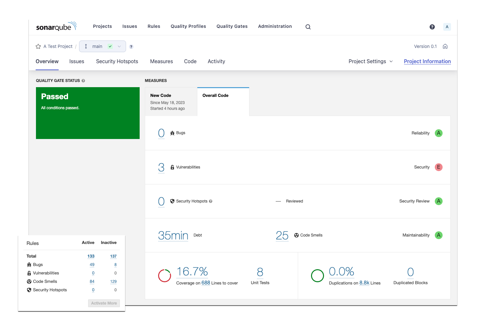

# SonarQube plugin for Flutter / Dart

A plugin to enable analysis of Dart and Flutter projects into SonarQube.

<p style="text-align: center">
	
</p>

## Features

| Feature    | Supported              |
|------------|------------------------|
| Size       | YES                    |
| Issues     | YES ([dartanalyzer](https://dart.dev/tools/dartanalyzer) rules)|
| Tests      | YES                    |
| Coverage   | YES                    |
| Complexity | YES                    |
| Syntax     | YES                    |

The plugin is compatible with sonarQube 6.7+.

## Download

Checkout the [Releases](https://github.com/insideapp-oss/sonar-flutter/releases) page.

Changelog is available [here](https://github.com/insideapp-oss/sonar-flutter/blob/develop/CHANGELOG.md).

## Prerequisites

### Flutter SDK

Install Flutter as explained on the official documentaiton page.

[Installation instructions](https://flutter.dev/docs/get-started/install)

### Dart

Dart is downloaded by the Flutter SDK in **$FLUTTER_HOME/bin/cache/dart-sdk**, however command lines are not on the path by default (dartanalyzer must be on the path).

It is recommanded to install Dart SDK separately as explained here : [Install the Dart SDK](https://dart.dev/get-dart) for more reliability in a CI/CD environement.

### sonar-scanner (requires Java)

Install sonar-scanner as explained in the official documentation.

[Installation instructions](https://docs.sonarqube.org/latest/analysis/scan/sonarscanner/)


## Installation (on the server)

- Download the plugin binary into the **$SONARQUBE_HOME/extensions/plugins** directory.
- Restart the server.

## Project configuration

Create a **sonar-project.properties** file at the root with this content :

```console
# Project identification
sonar.projectKey=flutter_rocks
sonar.projectName=Flutter Rocks
sonar.projectVersion=1.0
	
# Source code location.
# Path is relative to the sonar-project.properties file. Defaults to .
# Use commas to specify more than one folder.
sonar.sources=lib
sonar.tests=test
	
# Encoding of the source code. Default is default system encoding.
sonar.sourceEncoding=UTF-8
```

*For a complete list of available options, please refer to the [SonarQube documentation](https://docs.sonarqube.org/latest/analysis/analysis-parameters/).*


## Run analysis

Use the following commands from the root folder to start an analysis: 

```console
# Download dependencies 
flutter pub get 
# Run tests
flutter test --machine > tests.output
# Compute coverage (--machine and --coverage cannot be run at once...)
flutter test --coverage
# Run the analysis and publish to the SonarQube server
sonar-scanner
```
	
## Contributing

Any help is welcome, and PRs will be greatly appreciated!


## License

SonarQube Plugin for Flutter / Dart is released under the GNU LGPL v3 license. See the [LICENSE](https://github.com/insideapp-oss/sonar-flutter/blob/develop/LICENSE) file for more information.
